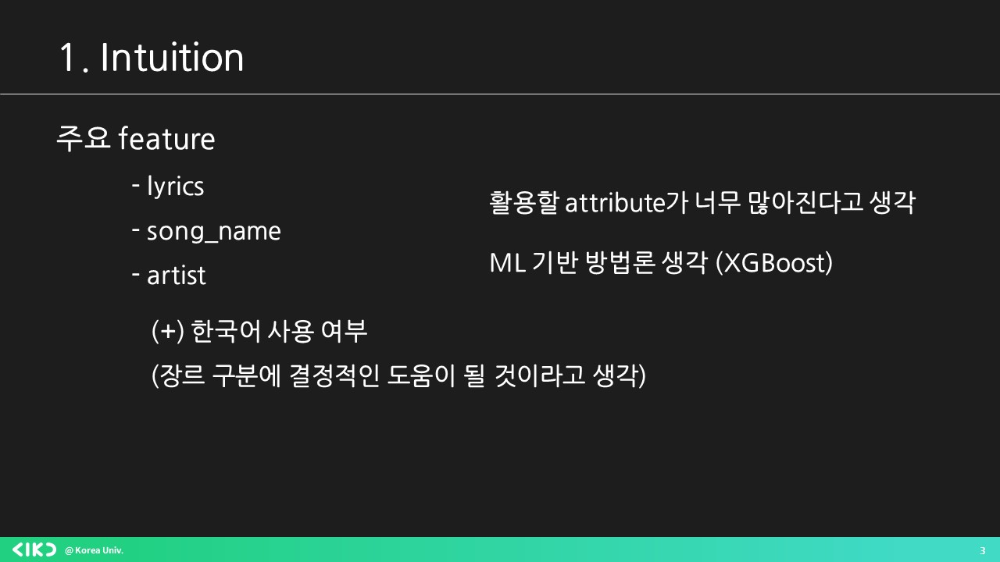
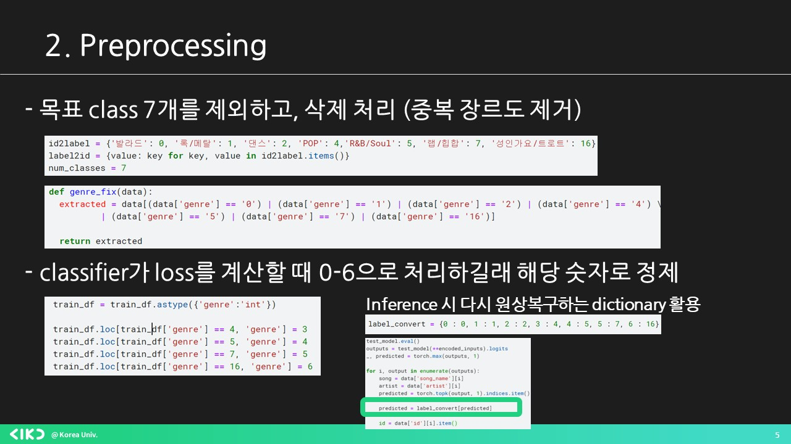
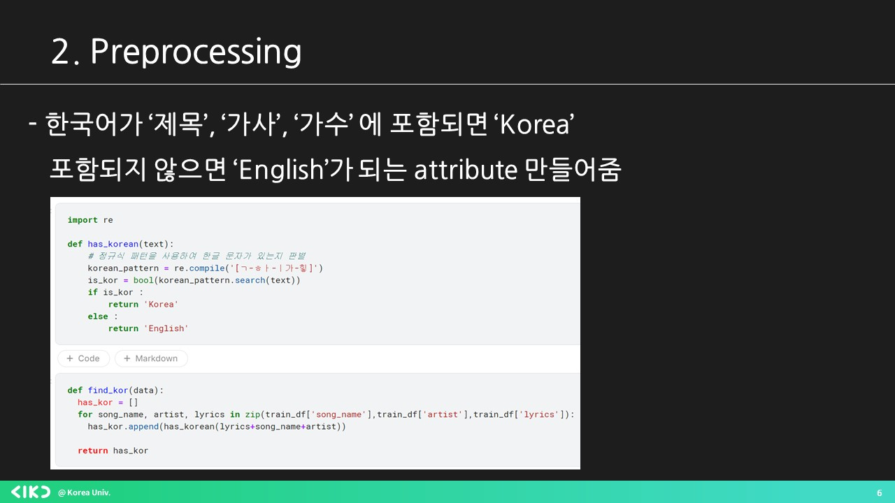
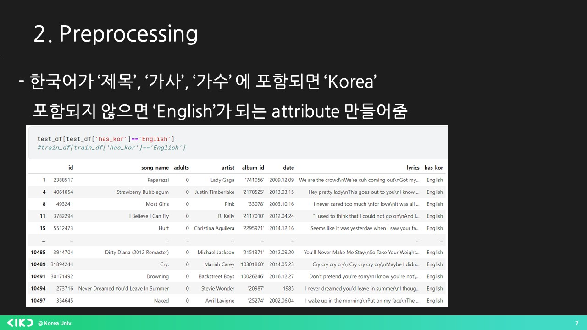
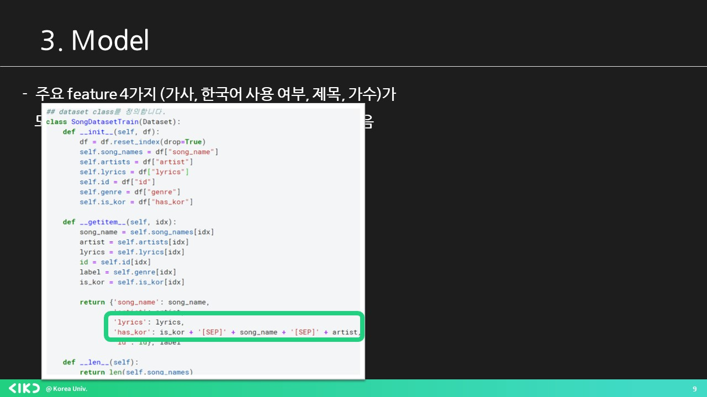
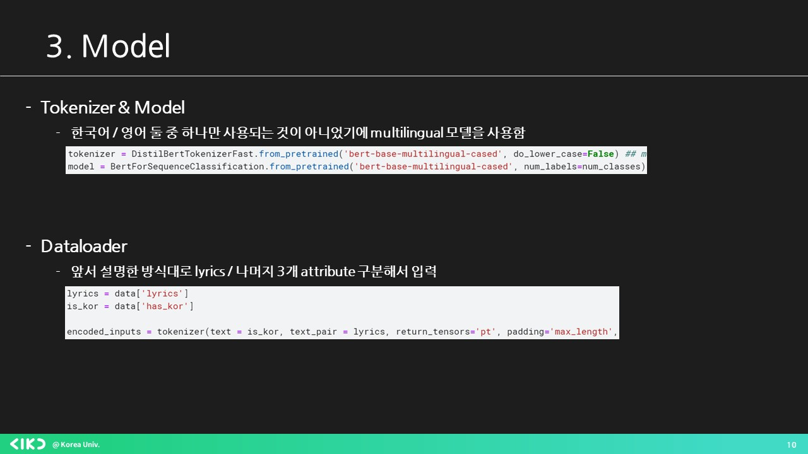
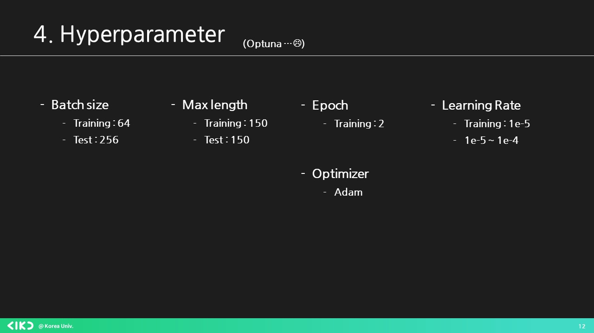
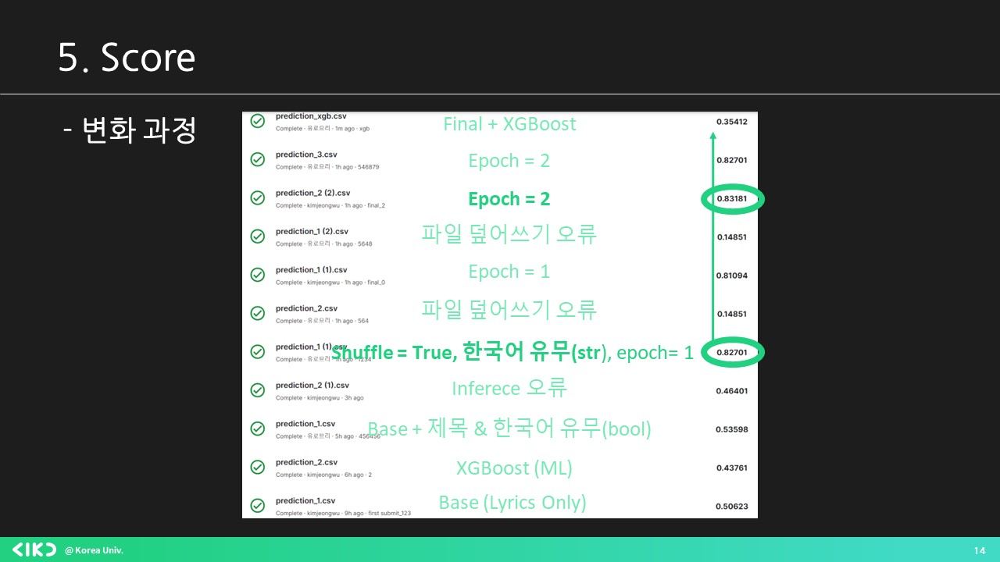

# AIKUTHON_3

## 행사 소개

- 네이버 D2의 지원 하에 AIKU 주관으로 진행한 **무.박.2.일 데이터톤**
- 일시: 2023년 8월 25일 (금) ~ 2023년 8월 26일 (토)
- 장소: 공간 스페이스 원오프 (서울 성북구 하월곡동)
- 대상: 2기 주니어 (필수) + 그외 학회원 (자율)

## 진행 방식

- 데이터 분석 및 머신러닝 플랫폼 Kaggle에서 Competition 형태로 진행
    
    [제 3회 AIKUTHON](https://www.kaggle.com/competitions/3-aikuthon)
    
- 타임라인
    
    | 25일 12 : 00 ~ 12 : 10 | 개회식 (참여 인원 확인, 대회 안내) |
    | --- | --- |
    | 25일 12 : 10 | 대회 시작 (데이터셋과 태스크 공개, 제출란 활성화) |
    | 26일 08 : 00 | 대회 종료 (제출란 비활성화, 발표 자료와 노트북 파일 제출 마감) |
    | 26일 08 : 00 ~ 09 : 30 | 팀별 발표, 평가, 폐회식 (시상) |

## 평가 및 시상

- 평가 기준은 다음과 같습니다:
    - 모델 성능 (Private score in Leaderboard) - 80%
    - 모델 이해도 & 한계 분석 - 15%
    - 팀원 역할 분배도 - 5%
    - 모델 속도 - Inference 시간이 15분 초과시, 15분당 1점 감점
    - 동점자가 발생할 경우 제출한 순서대로 순위 부여
- 평가 기준 상 가장 우수한 3팀에게 **총 상금 14만원**을 시상
    - 1등: 8만원
    - 2등: 4만원
    - 3등: 2만원
 
## Solution

### Intuition

### Preprocessing

### Model

### Hyperparameter

### Score(Result)

## Result
1등 우승~~

